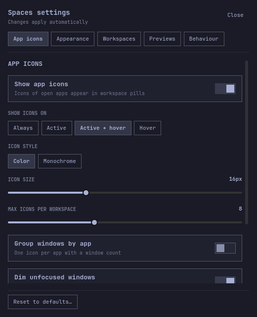

<h1 align="center">Spaces</h1>

<h3 align="center">See what runs on every workspace.</h3>

<p align="center">
  
</p>

Spaces is a workspace switcher for the [Omarchy](https://omarchy.org) bar. Each workspace shows the icons of the apps open on it. The active one slides open, and the focused window is highlighted.

## Peek before you jump

Hover another workspace to see it live, laid out the way it is on screen. Click a window in the preview to jump to it.

Previews follow the monitor's orientation, including portrait displays, and shrink to fit the available screen space while keeping the full workspace visible. The size setting controls the longest side, so portrait and landscape previews have a comparable size.

<p align="center">
  
</p>

## Know when your agent needs you

Terminals running Claude Code get a badge: a spinner while the agent works, a pulsing `!` when it needs your input, and a check mark when it is done. A workspace with an agent waiting on you pulses too. If a reporting process dies without sending `end`, the bar clears its live badge after the next process check, normally within a minute.

<p align="center">
  
</p>

To turn it on, add these hooks to `~/.claude/settings.json`:

```json
{
  "hooks": {
    "UserPromptSubmit": [{ "hooks": [{ "type": "command", "command": "~/.config/omarchy/plugins/tornikegomareli.spaces/hooks/claude-hook working", "async": true }] }],
    "PostToolUse": [{ "hooks": [{ "type": "command", "command": "~/.config/omarchy/plugins/tornikegomareli.spaces/hooks/claude-hook working", "async": true }] }],
    "Notification": [{ "hooks": [{ "type": "command", "command": "~/.config/omarchy/plugins/tornikegomareli.spaces/hooks/claude-hook waiting", "async": true }] }],
    "Stop": [{ "hooks": [{ "type": "command", "command": "~/.config/omarchy/plugins/tornikegomareli.spaces/hooks/claude-hook done", "async": true }] }],
    "SessionEnd": [{ "hooks": [{ "type": "command", "command": "~/.config/omarchy/plugins/tornikegomareli.spaces/hooks/claude-hook end", "async": true }] }]
  }
}
```

Other agents can report the same way: `omarchy-shell tornikegomareli.spaces agent <session> <working|waiting|done|end> <pids>`, where `<pids>` lists the agent's process and its parents, comma-separated.

### OpenCode

`hooks/opencode-plugin.js` is an OpenCode plugin that reports for you, so a terminal running OpenCode gets the same badge a Claude Code terminal gets. It reports through the `omarchy-shell` command above, so nothing else is needed.

Install it from npm:

```json
{
  "plugin": ["@farzadhayat/opencode-spaces"]
}
```

Or link this checkout in once (tracks the installed plugin through `omarchy plugin update`):

```sh
mkdir -p ~/.config/opencode/plugins
ln -sfn ~/.config/omarchy/plugins/tornikegomareli.spaces/hooks/opencode-plugin.js \
        ~/.config/opencode/plugins/spaces.js
```

The link points into the installed plugin, so `omarchy plugin update tornikegomareli.spaces` updates the reporter too. Restart OpenCode, run a prompt, and the terminal icon spins in the bar while it works and gets a check mark when it stops.

`working` and `done` are reported as OpenCode works. `waiting` needs a permission prompt, so with `--auto` it rarely appears: OpenCode answers its own permission requests in milliseconds, and the plugin waits 1.5s before showing a `!` so a prompt answered instantly never flashes. To see it, run `opencode` without `--auto` and ask it to do something that needs approval.

## Install

```sh
omarchy plugin add https://github.com/tornikegomareli/omarchy-spaces.git --enable
omarchy plugin disable omarchy.workspaces   # optional: replace the built-in switcher
```

Requirements:

- Omarchy 4 with the Quickshell bar (Hyprland 0.56 or newer)
- `jq` for the agent hook (installed with Omarchy)
- Claude Code or OpenCode, only for agent status

Works with the bar on any edge of the screen. Tested on a single monitor.

To update, then load the new code:

```sh
omarchy plugin update tornikegomareli.spaces
omarchy restart shell
```

## Remove

```sh
omarchy plugin remove tornikegomareli.spaces
omarchy plugin enable omarchy.workspaces   # bring back the built-in switcher
```

If you added the agent hooks or the settings key below, delete those lines from `~/.claude/settings.json` and `~/.config/hypr/bindings.lua`. If you linked the OpenCode plugin, remove the link:

```sh
rm ~/.config/opencode/plugins/spaces.js
```

## Using it

- Click a workspace to go there. Click an icon to focus that window.
- Scroll over the widget to move between workspaces.
- Hover an icon to see the window title.
- Hover another workspace to preview it. Click a window in the preview to focus it.
- Right-click the widget, or click the gear that shows on hover, to open settings.

## Settings



Choose when icons show (always, active, on hover, or never), icon style and size, grouping by app, previews, agent status, the active workspace style, density, and more. Settings are saved to `~/.config/omarchy/shell.json`.

To open settings with a key, add this to `~/.config/hypr/bindings.lua`:

```lua
o.bind("SUPER + CTRL + ALT + S", "Spaces settings", "omarchy-shell tornikegomareli.spaces toggle")
```

To preview a workspace from a key or script, without hovering:

```sh
omarchy-shell tornikegomareli.spaces peek 3
```

Settings can also be set from a script:

```sh
omarchy bar set tornikegomareli.spaces showApps all
```

<br clear="right" />

## Development

From a clone of this repository, link it into Omarchy and run the tests:

```sh
ln -sfn "$PWD" ~/.config/omarchy/plugins/tornikegomareli.spaces
omarchy plugin enable tornikegomareli.spaces
node tests/model.test.js
node tests/opencode-plugin.test.js
```

After code changes, run `omarchy restart shell`.

## License

[MIT License](LICENSE).
